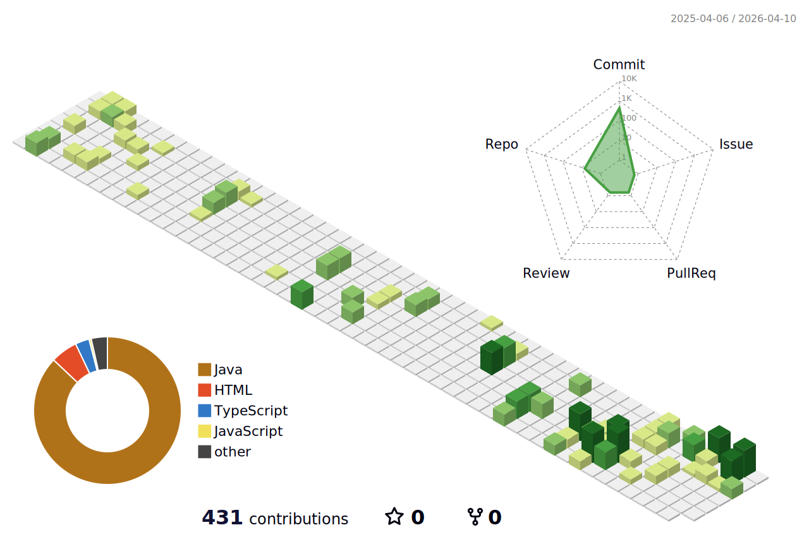

<!-- Centered Intro with Particles GIF -->

  

<h1 align="center">👋 Hey there, I'm Yogananth J</h1>

---

## 🌐 Connect with Me  

  
  
  

---

---

## 🛠️ Languages & Tools  

### 💻 Programming Languages  

  
  
  
  

### 🌐 Web Development  

  

### 🗄️ Database  

  
  

### 🤖 Machine Learning & AI  

  
  
  
  

### 📊 Data Analytics Tools  

  
  

### 🎨 Frontend & UI Tools  

  

### ⚙️ Other Tools  

  
  

---

## 📈 GitHub Stats & Analytics  

  

  
   
  
   
  

---

<!-- ## 💻 LeetCode Stats  

  

 -->

## 📊 My 3D Contribution Graph

  

